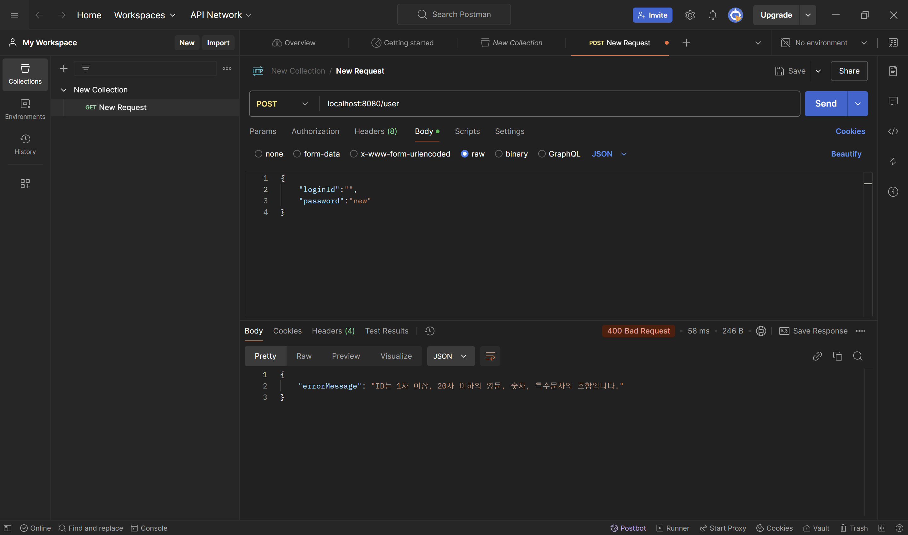
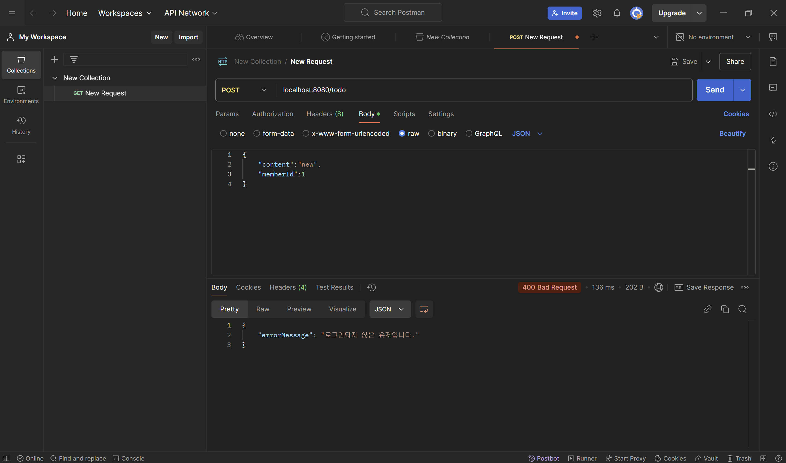

# 유효성 검사
어떤 HTTP 요청이든 일단 받은 후에 내장 컨트롤러 계층에서 처리하게 하면 요청이 터무니없거나 반복되는 등 리소스 낭비가 더 심해질 수 있다. 이를 위해 미리 컨트롤러 계층이 받아서 처리하기 전에 형식적인 검사를 해 일부를 걸러내면 컨트롤러 계층 내부에서 처리되는 정보의 양은 더 적어지지만 유의미해야하는 트랜잭션은 그대로이기 때문에 요청으로 들어오는 입력에 대해 유효성 검사를 하는 것이 좋다.
만약 유저를 생성할 때 1자 이상 20자 이하로 들어오게 유효성 검사를 적용하면 실제 들어오는 요청에서 로그인 아이디 또는 패스워드가 아예 없거나 20자 이상일 때 내부 처리까지 갈 것 없이 자체적으로 HTTP 응답을 생성해 내보내는 것을 볼 수 있다.

# GlobalExceptionHandler
서비스 계층의 트랜잭션이나 에러 처리등 모든 클래스나 메서드가 분명히 공통으로 가지는 관심사가 있다. 이런 관심이 반복되는 기능 혹은 작용을 단번에 간편하게 처리하기 위해 **AOP(Aspect-oriented Programming)** 즉 관심 지향 프로그래밍을 사용한다. 이것이 적용된 사례는 이미 서비스 계층에 있는 **@Transactional** 어노테이션과 지금 소개할 `GlobalExceptionHandler`가 있다. `GlobalExceptionHandler`는 스프링 애플리케이션을 실행하며 나는 오류를 일일이 각 컨트롤러 계층에서 잡지 않고 하나의 클래스에서 처리하기 위해 만들어진 개념으로, 클래스 선언 위에 **@ControllerAdvice** 어노테이션을 붙이면 그 클래스는 전역에서 에러 처리를 담당한다.
만약 할 일 생성 시 로그인 되지 않은 유저가 진행하려 하면 `BadRequestException` 예외가 던져지게 해놨고, 컨트롤러 계층에서 따로 처리하는 코드없이 GlobalExceptionHandler에서 처리하게 해놓았다.
```java
package com.example.spring2024.common;

import com.example.spring2024.common.dto.ErrorResponse;
import com.example.spring2024.common.exception.BadRequestException;
import com.example.spring2024.common.exception.InternalServerErrorException;
import org.springframework.http.ResponseEntity;
import org.springframework.http.converter.HttpMessageNotReadableException;
import org.springframework.web.HttpMediaTypeNotAcceptableException;
import org.springframework.web.HttpMediaTypeNotSupportedException;
import org.springframework.web.HttpRequestMethodNotSupportedException;
import org.springframework.web.bind.MethodArgumentNotValidException;
import org.springframework.web.bind.annotation.ControllerAdvice;
import org.springframework.web.bind.annotation.ExceptionHandler;

@ControllerAdvice
public class GlobalExceptionHandler {
    @ExceptionHandler(value = Exception.class)
    public ResponseEntity<com.example.spring2024.common.dto.ErrorResponse> handleUnknownException(Exception ex) {
        com.example.spring2024.common.dto.ErrorResponse errorResponse = new ErrorResponse(ex.getMessage());
        return ResponseEntity.internalServerError().body(errorResponse);
    }

    @ExceptionHandler(value = BadRequestException.class)
    public ResponseEntity<ErrorResponse> handleBadRequestException(BadRequestException ex) {
        ErrorResponse errorResponse = new ErrorResponse(ex.getMessage());
        return ResponseEntity.badRequest().body(errorResponse);
    }

    @ExceptionHandler(value = InternalServerErrorException.class)
    public ResponseEntity<ErrorResponse> handleInternalServerErrorException(InternalServerErrorException ex) {
        ErrorResponse errorResponse = new ErrorResponse(ex.getMessage());
        return ResponseEntity.internalServerError().body(errorResponse);
    }

    //DTO 에서 유효성 검사가 실패했을 때 대신 응답하는 핸들러
    @ExceptionHandler(value = MethodArgumentNotValidException.class)
    public ResponseEntity<ErrorResponse> handleMethodArgumentNotValidException(MethodArgumentNotValidException ex) {
        String message = ex.getBindingResult().getAllErrors().get(0).getDefaultMessage();
        ErrorResponse errorResponse = new ErrorResponse(message);
        return ResponseEntity.badRequest().body(errorResponse);
    }

    @ExceptionHandler(value = HttpMessageNotReadableException.class)
    public ResponseEntity<ErrorResponse> handleHttpMessageNotReadableException(HttpMessageNotReadableException ex) {
        ErrorResponse errorResponse = new ErrorResponse(ex.getMessage());
        return ResponseEntity.badRequest().body(errorResponse);
    }

    @ExceptionHandler(value = HttpRequestMethodNotSupportedException.class)
    public ResponseEntity<ErrorResponse> handleHttpRequestMethodNotSupportedException(HttpRequestMethodNotSupportedException ex) {
        ErrorResponse errorResponse = new ErrorResponse(ex.getMessage());
        return ResponseEntity.badRequest().body(errorResponse);
    }

    @ExceptionHandler(value = HttpMediaTypeNotSupportedException.class)
    public ResponseEntity<ErrorResponse> handleHttpMediaTypeNotSupportedException(HttpMediaTypeNotSupportedException ex) {
        ErrorResponse errorResponse = new ErrorResponse(ex.getMessage());
        return ResponseEntity.badRequest().body(errorResponse);
    }

    @ExceptionHandler(value = HttpMediaTypeNotAcceptableException.class)
    public ResponseEntity<ErrorResponse> handleHttpMediaTypeNotAcceptableException(HttpMediaTypeNotAcceptableException ex) {
        ErrorResponse errorResponse = new ErrorResponse(ex.getMessage());
        return ResponseEntity.badRequest().body(errorResponse);
    }
}
```
```
@Transactional
    public Long createTodo(String content,Long memberId) throws BadRequestException {
        Member member = memberRepository.findById(memberId);
        if(member == null) throw  new BadRequestException(ErrorMessage.MEMBER_NOT_EXIST.getMessage());
        if(!member.isSigned()) throw new BadRequestException(ErrorMessage.NOT_SIGNED.getMessage());

        Todo todo = new Todo(member,content);
        todoRepository.save(todo);
        return todo.getId();
    }
```
이럴 경우 아래와 같이 GlobalExceptionHandler의 메시지가 출력된다.
