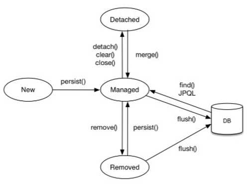

# 영속성 컨테스트와 트랜잭션
영속성 컨테스트가 뭐고, 왜 쓰는지는 지난주에 좀 알아봤었는데, 이번엔 실제 구현을 하고 사용해본 경험을 토대로 생각해보자.
```java
package com.example.spring2024.friend;

import com.example.spring2024.member.Member;
import jakarta.persistence.EntityManager;
import jakarta.persistence.PersistenceContext;
import org.springframework.stereotype.Repository;

@Repository
public class FriendRepository {

    @PersistenceContext
    private EntityManager em;

    public void save(Friend friend) {
        em.persist(friend);
    }

    public Friend findById(Long FriendId) {
        return em.find(Friend.class,FriendId);
    }

    public void updateById(Long FriendshipId,Long UserId,Long FriendId) {
        Friend friendship = em.find(Friend.class,FriendshipId);
        Member user = em.find(Member.class,UserId);
        Member friend = em.find(Member.class,FriendId);
        if(user!=null&&friend!=null) {
            friendship.updateFriendship(user,friend);
        }

    }

    public void deleteById(Long FriendId) {
        Friend friend = em.find(Friend.class, FriendId);
        em.remove(friend);
    }

    public void flushAndClear(){
        em.flush();
        em.clear();
    }
}
```
위는 내가 만든 H2데이터베이스와 소통하기 위해 JPA상에서 레포지토리 단계를 구현한것이고, 그중에서도 "Friend" 엔티티를 관리하기 위한 레포지토리다. 위 코드를 통해 코드 편집기 상에서 객체로 보이는 것을 데이터베이스에 레코드로 전달을 하고, 전달받는 과정도 그 반대로 똑같이 한다.
```java
@Repository
public class FriendRepository {
    //...
}
```
**@Repository** 어노테이션은 이 클래스를 JPA의 레포지토리 계층으로 이용한다는 상징을 줌과 동시에, 내부적으로 빈으로써 컨테이너에 등록시키는 **@Component** 기능이 들어가 있다.
```java
@PersistenceContext
private EntityManager em;
```
이 부분에서 **영속성 컨텍스트**가 등장한다. 영속성 컨텍스트 또한 컨테이너처럼 직접 클래스로 구현되거나 하는 것이 아니라 거의 내부에 틀로써 자리잡는다고 봐야한다. 영속성 컨텍스트는 특정 엔티티를 관리하는 **엔티티 관리자** 클래스가 만들어질때 같이 생성되고, 이 엔티티 관리자 클래스를 통해 접근한다. **@PersistenceContext** 어노테이션으로 등록한다.

지난 주 영속성 컨텍스트의 존재로 인해 엔티티의 상태는 4가지로 나뉜다고 했었다.
> **비영속 / 준영속 / 영속 / 삭제**

영속성 컨텍스트에 처음 들어간 후엔 **영속**
잠시 떨어지게 하면 **준영속**
생성된 후 들어가지 않은 상태면 **비영속**
컨텍스트와 DB 둘다에서 삭제된 상태는 **삭제**
```java
public void save(Friend friend) {
        em.persist(friend);
    }
```
save 함수는 엔티티 매니저의 **Persist** 함수를 쓰는데, 이것은 영속성 컨텍스트에 엔티티를 집어넣는 함수로, 이 함수를 호출한 후 대상이 되는 엔티티는 **영속** 상태다. CRUD중 **Create**에 해당한다.
```java
public Friend findById(Long FriendId) {
        return em.find(Friend.class,FriendId);
    }
```
findById 함수는 영속성 컨텍스트와 관련된 내용은 다루지 않지만, CRUD중에서는 **Read**에 해당한다.
```java
public void updateById(Long FriendshipId,Long UserId,Long FriendId) {
        Friend friendship = em.find(Friend.class,FriendshipId);
        Member user = em.find(Member.class,UserId);
        Member friend = em.find(Member.class,FriendId);
        if(user!=null&&friend!=null) {
            friendship.updateFriendship(user,friend);
        }
    }
```
updateById 함수 또한 영속성 컨텍스트와 관련된 내용은 없지만 CRUD중에서 **Update**에 해당한다.
```java
public void deleteById(Long FriendId) {
        Friend friend = em.find(Friend.class, FriendId);
        em.remove(friend);
    }
```
deleteById 함수는 엔티티 매니저의 remove함수를 사용하고, 이름에서 보이듯이 엔티티를 **삭제** 상태로 만든다. CRUD중에서 **Delete**에 해당한다. 이 상태에서 위의 friend 객체와 같은 FriendId를 사용하는 또다른 friend 객체를 컨텍스트나 데이터베이스에서 접근하는 함수를 테스트 코드로 실행할 경우, 없기 때문에 **null에 해당하는 예외처리를 하지 않으면 에러가 난다**.
```java
public void flushAndClear(){
        em.flush();
        em.clear();
    }
```
flushAndClear 함수는 엔티티 매니저의 flush 함수와 clear 함수를 사용한다.
아래 이미지를 한번 보자.
>

영속성 컨텍스트의 상태전이도를 잘 보여주고 있다.
flush 함수는 삭제(Removed) 상태 또는 영속(Managed) 상태에서 **트랜잭션**을 DB에 커밋하는 역할을 한다.
> **트랜잭션이란?**</br>
> 데이터베이스가 받아들이고 수행하는 명령어의 단위

데이터베이스라는 것이 안에서 객체들이 구슬마냥 움직였다가 부서졌다가 하는 행위를 실제로 하는 것이 아니라, 메모리의 워드(명령어 한 줄)를 CPU가 읽어 그만큼 반복하는 것처럼, 데이터베이스도 정보를 메모리처럼 어떤 상태로 저장하고, 우리가 접근하거나 수정하면 이 트랜잭션을 명령어의 단위로써 반복적으로 처리한다고 보면된다. 트랜잭션을 통해 데이터베이스에 추가,유지,수정,조회를 통한 반환을 수행한다.

JPA의 레포지토리는 데이터베이스와 트랜잭션 단위로 요청하고 정보를 받기 때문에 flush와 같은 함수를 쓴다고 보면 된다. 영속성 컨텍스트가 전과 상태가 달라졌고, 이 상태를 데이터베이스에 저장하고 싶을 때 flush를 쓰면 커밋된다.

커밋을 변경 사항을 업로드하는 것이라고 생각하면 된다. 깃허브를 이용한다면 이미 알고 있을 것이다.</br>
[커밋이란?](https://hoohaha.tistory.com/105)

clear 함수는 영속성 컨텍스트에 있는 모든 엔티티를 준영속 상태로 만들고(이미 한번 등록된 것을 다시 내보냄) 영속성 컨텍스트를 깨끗한 상태로 초기화하는 것이다.